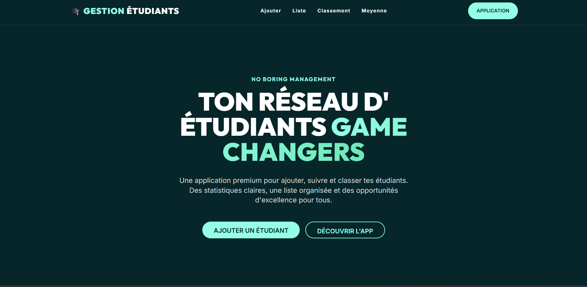

# 🎓 Gestion des Étudiants - Édition Premium



## 🔗 Démo en Direct
**[🚀 Accéder à l'application déployée sur Render](https://students-nayo.onrender.com)**

## 💡 À Propos du Projet
Ce projet est une application web élégante et performante permettant de gérer un réseau d'étudiants. Son design sombre et minimaliste ("Premium Dark/Mint") a été minutieusement inspiré du style *Champions for Good*, offrant une navigation douce (« glassmorphism ») et une interface très ergonomique pour les administrateurs.

## ✨ Fonctionnalités Principales
- **➕ Ajouter un étudiant** : Intégrez de nouveaux profils à votre réseau instantanément.
- **📋 Liste Complète** : Accédez au répertoire complet de vos étudiants sauvegardés.
- **📝 Gestion des Notes** : Ajoutez, consultez ou supprimez les notes sur 20 de chaque élève.
- **🏆 Classement Élite** : Visualisez les meilleurs éléments de votre classe (Or, Argent, Bronze).
- **📊 Moyenne Générale** : Obtenez instantanément la moyenne globale des performances grâce à un superbe tableau de bord.

## 🛠️ Technologies Utilisées
- **Frontend** : HTML5, CSS3, JavaScript Vanilla
- **Styling** : Tailwind CSS (via CDN) & DaisyUI
- **Backend / API** : Node.js avec Express.js
- **Base de données** : Fichier JSON local (`data.json`)
- **Hébergement** : Render

## 💻 Installation en Local

Si vous souhaitez exécuter ce projet sur votre propre machine :

1. Clonez ce dépôt ou téléchargez le code source.
2. Assurez-vous d'avoir [Node.js](https://nodejs.org/) installé sur votre PC.
3. Ouvrez un terminal dans le dossier du projet et installez les dépendances :
   ```bash
   npm install
   ```
4. Lancez le serveur localement :
   ```bash
   npm start
   ```
   *(ou `node --watch server.js` pour relancer automatiquement lors du développement)*
5. Ouvrez le lien suivant dans votre navigateur : [http://localhost:3000](http://localhost:3000)

---
*Design moderne et interface conçus pour un management de qualité supérieure.*
